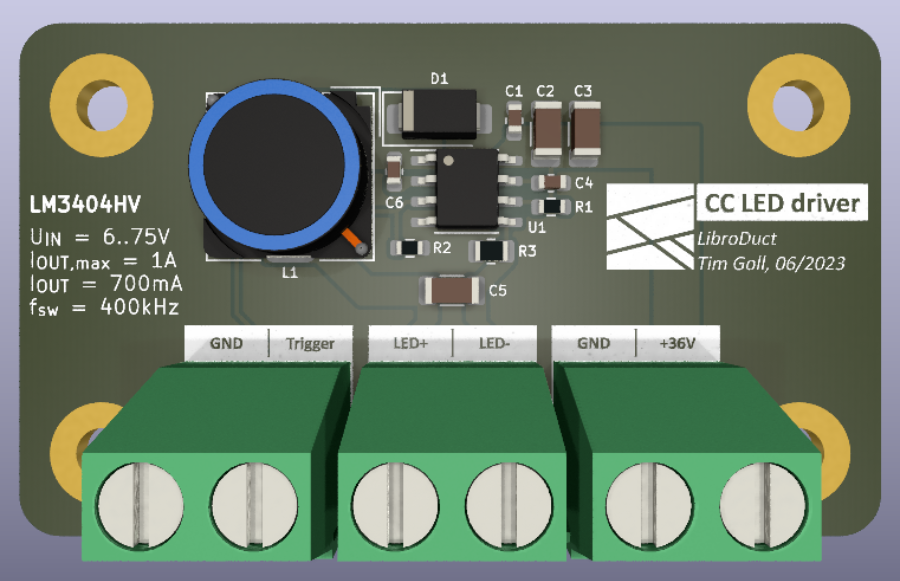
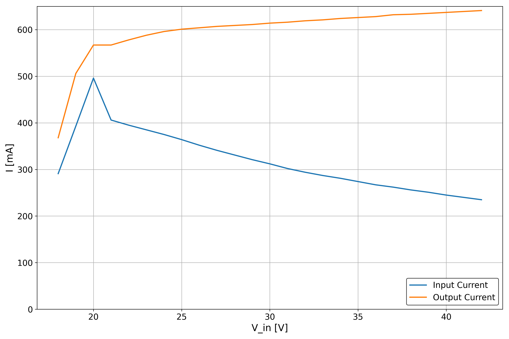
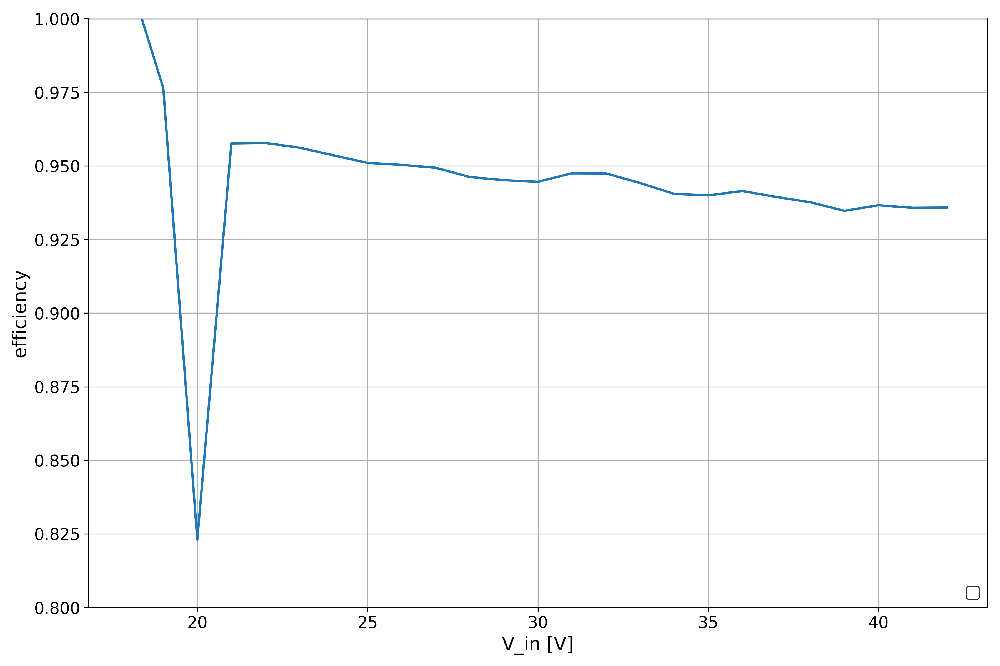
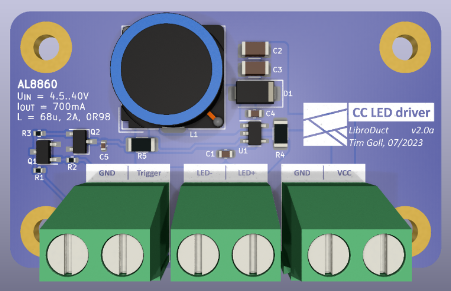
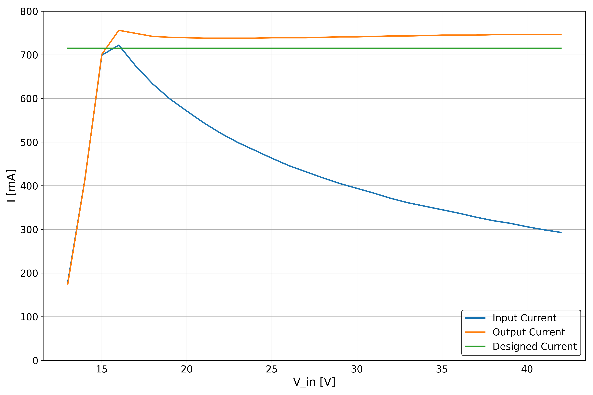
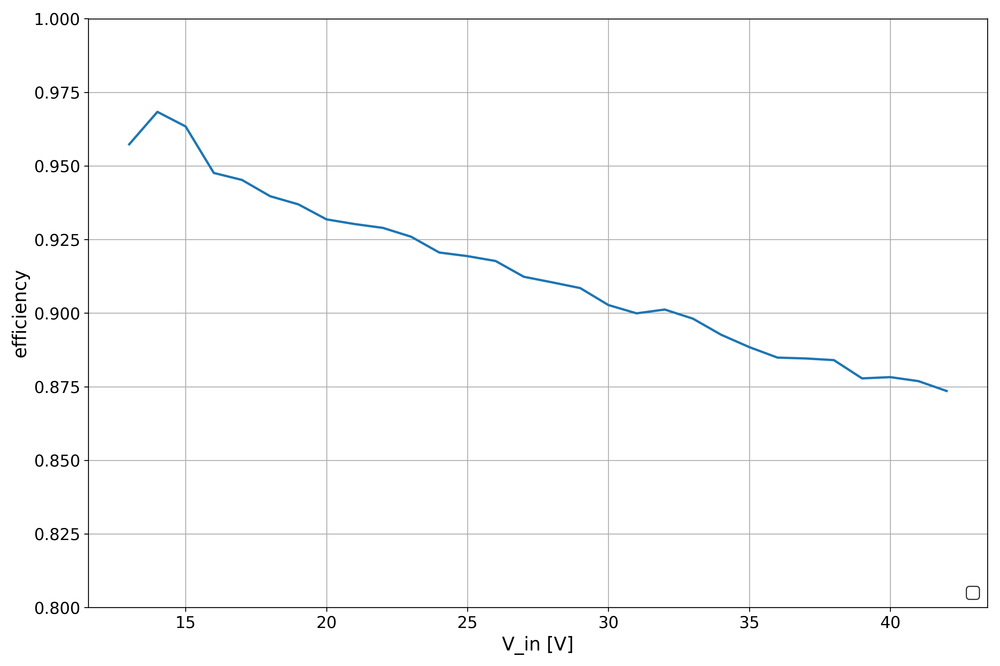
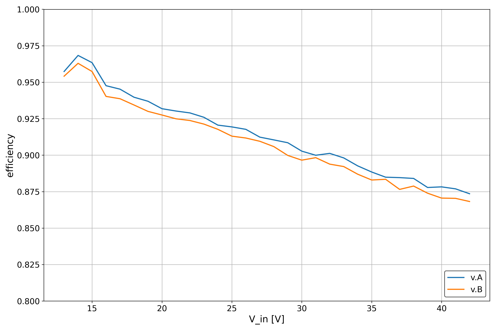
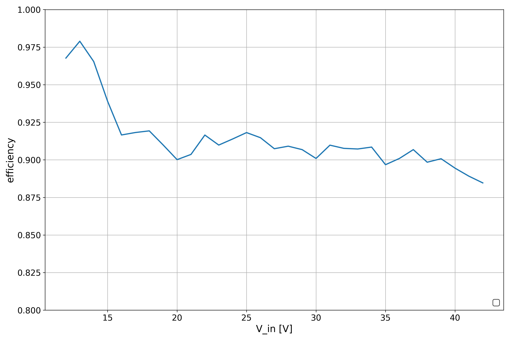
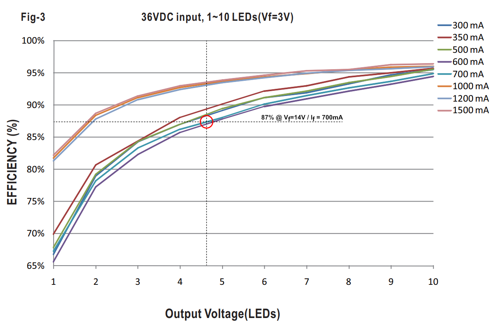
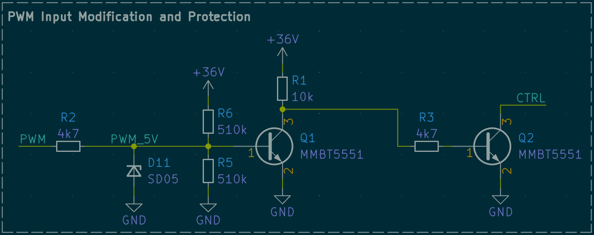

# LED Constant Current Driver Design

This project is part of [LibroDuct](https://www.libroduct.com/). We decided to publish some results of our LED driver designs to support the opensource maker scene. Feel free to use those results in your designs.

All those designs were tested with [9 IR-LEDs](https://jlcpcb.com/partdetail/Xssy-SE03_EMC3838AA60/C5205224) in series. These had a forward voltage of `14.0V`.

## LM3404 Constant Current Driver

The [LM3404 and LM3404HV](https://www.ti.com/lit/ds/symlink/lm3404.pdf) devices are monolithic switching regulators designed to deliver constant currents to high power LEDs. Ideal for automotive, industrial, and general lighting applications, these devices contain a high-side N-channel MOSFET switch with a current limit of 1.5A (typical) for step-down (Buck) regulators. Hysteretic controlled on-time and an external resistor allow the converter output voltage to adjust as needed to deliver a constant current to series and series-parallel connected LED arrays of varying number and type. 

_(LM3404 testing PCB render)_

The layout of the PCB closely resembles the recommended design shown in the datasheet.

_(LM3404 input and output current)_

As can be seen in this plot, the output current is not that stable when the input voltage is changed. This makes the chip unusable for applications with a varying input voltage.

_(LM3404 efficiency)_

TODO: Replace graph with better data. Chip seems to be quite efficient.

## AL8860 Constant Current Driver

The [AL8860](https://www.diodes.com/assets/Datasheets/AL8860.pdf) is a hysteresis mode DC-DC step-down converter, designed for driving single or multiple series connected LEDs efficiently from a voltage source higher than the LED voltage. The device can operate from an input supply between `4.5V` and `40V` and provide an externally adjustable output current up to `1A` for TSOT25 package and `1.5A` for MSOP-8EP package.

_(AL8860 testing PCB render)_

The curcuit designed is similar to the previous circuit but produces way better results thanks to the changed driving IC.

_(AL8860 input and output current)_

The above plot shows the input and output current. The output current is rather stable over the supported input voltage. This makes the circuit suitable for our needs.

It is also worth mentioning that the output current is a bit higher than the designed current. This is fine in our usecase but it is something to be aware of.

_(AL8860 driver efficiency at 700mA)_

### The Influence of Coil Selection

Another test we did with these drivers is so test and asses the influence of different coils on the efficiency. Especially the influence of the DC resistance.

_(AL8860 driver efficiency when tested with different coils)_

The above plot shows the same AL8860 driver that was used previously, but we added another coil in the mix. `v.A` uses a coil with a DC resistance of `98mΩ`, `v.B` has a DC resistance of `201mΩ`. The inductance of both coils is identical.

It can be seen that the efficiency drops with higher DC resistance as this energy is lost in the form of heat created. It is therefore reasonable to use a bigger and better coil if the space is not constrained.

### 1.5A Driver with AL8860MP

There is also an `1.5A` version available of the driving IC. I tested it as well and got really good results. It seems to be a bit more efficient than the `700mA` version. This could also be due to two LED strings being in parallel or the lower value of the shunt resistor.

_(AL8860MP driver efficiency at 1.5A)_

### Comparison

There are many off-the-shelf LED driver modules available. One of them, the [Meanwell LDD700LS](https://www.meanwell-web.com/content/files/pdfs/productPdfs/MW/LDD-l/ldd-l-spec.pdf) was used here as a refernce point. When supplied with `36V` at `700mA` and a LED forward voltage of `14V`, it seems to have an efficieny of `87%`. Even in our worst case scenario our driver is more efficient.

_(LDD700LS driver module efficiency [fig 3, page 4])_

### Trigger Signals

Since the dimming pin of most LED driver ICs is open drain with a limited voltage range, we need additional circuitry to get what we need. Also many ICs support analog dimming with values over 100% if the internal ref voltage is surpassed which forces us to use the internal pullup.

The following circuit achieves all of that, while also supporting trigger voltages as high as VCC of the LED board, while also making sure that pulling the input to ground still disables it.

By default this circuit turns the device on and has to be actively turned off.

_(PWM input modification schematic)_
